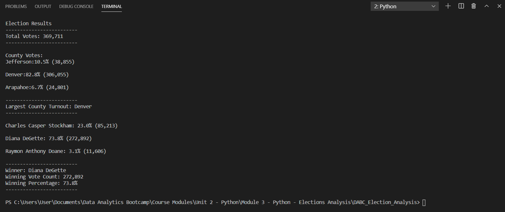
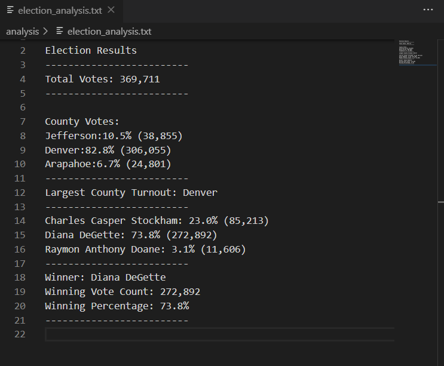

# DABC_Election_Analysis
Data Analytics Boot Camp Module 3 & Challenge 3 - Python - Election Analysis

# Election Audit Overview
To perform election audit of a state of Colorado local congressional election to be submitted to the election commission.

The analysis will have a number of objectives as illustrated below:
 
1. Calculate the total number of votes cast.
2. Get a complete list of candidates who received vots.
3. Calculate the total number of votes each candidate received.
4. Calculate the percentage of votes each candidate won.
5. Determine the winner of the election based on popular vote.
6. The voter turnout for each county
7. The percentage of votes from each county out of the total count.
8. The county with the highest turnout.

# Resources
- Data source: election_results.csv
- Software: Python 3.7.6, VS Code 1.51.0

# Election-Audit Results:
The analysis of the election show that:
- There were 369,711 vote casts in the election.
- The candidates were:
  - Charles Casper Stockham
  - Diana DeGette
  - Raymon Anthony Doane
- The candidates results were:
  - Charles Casper Stockham received 23% of the vote and 85,213 votes.
  - Diana DeGette received 73.8% of the vote and 272,892 votes.
  - Raymon Anthony Doane received 3.1% and 11,606 votes.
- The winner of the election was:
  - Diana DeGette who received 73.8% of the vote and 272,892 votes.
- The counties were
  - Jefferson
  - Denver
  - Arapahoe
- Voter turnout summary as follows:
  - Jefferson had 10.5% of the vote and 38,855 votes
  - Denver had 82.8% of the vote and 306,055 votes
  - Arapahoe had 6.7% of the vote and 24,801 votes
- The county with the highest turnout (largest number of votes) was:
  - Denver
- Below screenshot shows the output of the code in the Terminal
 
  </img>

- Below screenshot shows the output of the code in the Text File

  </img>

 # Election-Audit Summary:
 - This code can be modified to accomodate for different levels of elections, for example, the presidential elections. The variables/lists/dictionaries can be changed to reflect names and votes of states instead of counties.

 - This code can also be modified based on how information is provided on the source file. In other elections, the data may not necessarily be presented in the same format and order as shown in the election_results.csv (Ballot ID, then County, then Candidate). Hence, the indexing within the codes to get the County name and Candidate name may have to be updated based on the information presented to us.
 
 
 
 
